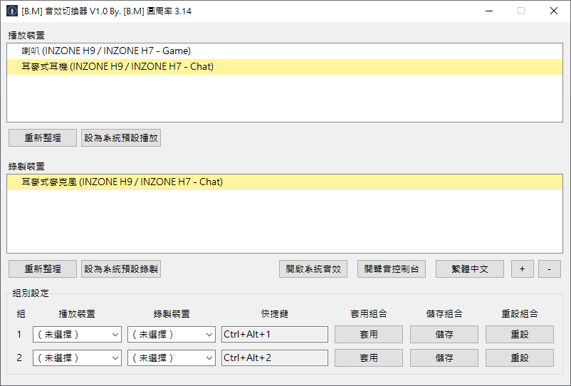

# [B.M] 音效切換器

[](#系統需求)
[](https://www.python.org/)
[](https://pyinstaller.org/)
[](https://github.com/BoringMan314/bm-sound-effects-switch)
[](LICENSE)

Windows 音效裝置切換工具，支援播放／錄製預設裝置一鍵套用、全域熱鍵、系統匣操作與多語系介面。

*Windows 音效设备切换工具，支持播放/录制默认设备一键应用、全局热键、系统托盘操作与多语言界面。*  

*Windows の音声デバイス切替ツール。再生/録音の既定デバイスをワンクリック適用、グローバルホットキー、トレイ操作、多言語 UI に対応。*  

*A Windows audio device switcher with one-click default playback/recording apply, global hotkeys, tray controls, and multilingual UI.*

> **聲明**：本專案為第三方輔助工具，請遵守各平台與軟體使用規範。

---



---

## 目錄

- [功能](#功能)
- [系統需求](#系統需求)
- [安裝與打包](#安裝與打包)
- [檢查流程（建議）](#檢查流程建議)
- [本機開發與測試](#本機開發與測試)
- [技術概要](#技術概要)
- [專案結構](#專案結構)
- [設定檔與多語系](#設定檔與多語系)
- [隱私說明](#隱私說明)
- [授權](#授權)
- [問題與建議](#問題與建議)

---

## 功能

- 顯示播放／錄製裝置清單，快速設為系統預設。
- 裝置組（預設）可保存多組「播放 + 錄製」組合。
- 每組可自訂全域快捷鍵（預設相容 `Ctrl+Alt+1` ~ `Ctrl+Alt+0`）。
- 內建語言：繁體中文、簡體中文、日本語、English；**可**在設定檔根層 `languages` **新增**其他語系代碼。**每一**語系物件的**鍵集合**須與程式內建 **`_DEFAULT_ZH_TW`**（`main.py`，等同 `SOUND_I18N_REF_KEYS`）**完全一致**，缺一即驗證失敗，程式會刪除壞檔並寫入內建預設。
- 系統匣：
  - 左鍵預設動作可將視窗還原到 `100,100`
  - 右鍵選單：關於我、離開（鍵名 `about`、`exit`）
- 防多開：後開會嘗試關閉前開（含 EXE 改名／複製情境）。
- 開關或套用時播放 `wav/switch.wav` 音效。

---

## 系統需求

- **Windows 10+**（一般使用專案根目錄的 `bm-sound-effects-switch.exe`）。
- **Windows 7** 請使用專案根目錄的 **`bm-sound-effects-switch_win7.exe`**；執行前請完成下方〈Win7 執行前必要環境〉（細節與疑難排解見 `README-WIN7.txt`）。
- 開發／**Win10 鏈**打包需本機 **Python 3.10+**；**Win7 鏈**打包需本機 **Python 3.8.x**。
- 64-bit 環境（預設發行檔為 onefile）。

### Win7 執行前必要環境

- Windows 7 SP1。
- 安裝系統更新：`KB2533623`、`KB2999226`（Universal CRT）。
- 安裝 **Microsoft Visual C++ Redistributable 2015–2022**（x86／x64 依系統選擇）。
- 若啟動仍出現缺少 `api-ms-win-core-*.dll`，請依 `README-WIN7.txt` 核對更新與執行檔版本後再試。

---

## 安裝與打包

### 安裝（使用 Releases）

1. 下載 [Releases](https://github.com/BoringMan314/bm-sound-effects-switch/releases) 的 `bm-sound-effects-switch.exe`（Win7 請用 `bm-sound-effects-switch_win7.exe`）。
2. 放到任意資料夾後直接執行。
3. 首次執行會在同目錄建立 `bm-sound-effects-switch.json`。

### Windows 7

```bat
build_win7.bat
```

輸出（專案**根目錄**）：

- `bm-sound-effects-switch_win7.exe`

### Windows 10/11

```bat
build_win10.bat
```

輸出（專案**根目錄**）：

- `bm-sound-effects-switch.exe`

### Windows（雙工具鏈：Win10/11 + Win7）

```bat
build_win10+win7.bat
```

或：

```powershell
powershell -ExecutionPolicy Bypass -File .\build.ps1
```

可指定不同 Python 版本（建議）：

```powershell
powershell -ExecutionPolicy Bypass -File .\build.ps1 -PyWin10 "py -3.13" -PyWin7 "py -3.8"
```

輸出（專案**根目錄**）：

- `bm-sound-effects-switch.exe`
- `bm-sound-effects-switch_win7.exe`

說明：

- PyInstaller 先輸出至暫存目錄 `dist`，`build_win10.bat`／`build_win7.bat` 會將 exe **搬移到專案根目錄**，再清空 `build`／`dist` 內容。
- `bm-sound-effects-switch.exe`：使用 `requirements-win10.txt`（Win10/11 工具鏈）。
- `bm-sound-effects-switch_win7.exe`：使用 `requirements-win7.txt`（Win7 相容工具鏈）。
- 在 Win7 上請執行 `bm-sound-effects-switch_win7.exe`，不要執行 `bm-sound-effects-switch.exe`。
- 兩份 `.bat` 直接使用 PATH 上的 Python；若改跑 `build.ps1`，仍會建立 `.venv-build-win10`、`.venv-build-win7` 以隔離兩套依賴。

> 若僅手動執行 PyInstaller 而未使用本專 `build_win10.bat`／`build_win7.bat`／`build.ps1`，產物通常留在 `dist\`，不會自動搬至根目錄。

> Win7 版若遇到 `api-ms-win-core-*.dll` 缺失，請依上文〈Win7 執行前必要環境〉與 `README-WIN7.txt` 處理。

---

## 檢查流程（建議）

1. 啟動後主視窗是否出現於第一螢幕約 `100,100`。
2. 播放／錄製裝置清單是否正確；設為系統預設是否生效。
3. 至少一組全域快捷鍵能否套用已儲存的裝置組；快捷鍵在視窗縮到系統匣後是否仍可用。
4. 語言按鈕循環、`bm-sound-effects-switch.json` 讀寫是否正常（**每個**語系區塊鍵集須與內建 `zh_TW` 一致，否則會覆寫為預設）。
5. 系統匣左鍵預設動作能否還原視窗；右鍵「關於我」「離開」是否正常。
6. 連續啟動兩次是否僅保留最後一個實例。
7. 預設組「儲存／套用」與組數增減（在允許範圍內）是否與設定檔一致。

---

## 本機開發與測試

```bash
python -m pip install -r requirements-win10.txt
python main.py
```

---

## 技術概要

- GUI：`tkinter`
- 音訊控制：`pycaw` + `comtypes`（Windows Core Audio）
- 系統匣：`pystray` + `Pillow`
- 熱鍵：`keyboard` 套件（全域熱鍵）
- 打包：`pyinstaller`
- 設定檔：EXE 同層 `bm-sound-effects-switch.json`（Win10／Win7 exe 共用）

---

## 專案結構


| 路徑                            | 說明                              |
| ----------------------------- | ------------------------------- |
| `main.py`                      | 主程式（UI、裝置切換、熱鍵、系統匣、防多開）         |
| `build_win7.bat`               | Win7 單檔打包（最終 exe 於專案根目錄）          |
| `build_win10.bat`              | Win10 單檔打包（最終 exe 於專案根目錄）         |
| `build_win10+win7.bat`         | Win10 + Win7 雙版（呼叫 `build.ps1`） |
| `build.ps1`                    | Windows 雙版打包腳本（PowerShell）      |
| `version_info.txt`             | Windows exe 檔案版本資源               |
| `requirements-win10.txt`       | Win10/11 打包用 Python 相依套件       |
| `requirements-win7.txt`        | Win7 打包用 Python 相依套件         |
| `README-WIN7.txt`              | Win7 執行環境（KB／VC++）說明          |
| `icons/`                       | 圖示資源（`icon.ico`、`icon.png`）   |
| `wav/`                         | 音效資源（`switch.wav`）              |
| `screenshot/`                  | README 展示截圖（選用）                 |


---

## 設定檔與多語系

- 設定檔：`bm-sound-effects-switch.json`（與 exe 同層）。
- 根層另有 `settings`（含 `languages` 目前 UI 代碼）、`num_groups`、`groups` 等，見 `main.py` 之 `default_config()`／驗證邏輯。
- **內層嚴格**：根層 `languages` 底下**每一個**語系物件的**鍵集合**須與 **`main.py` 內建 `_DEFAULT_ZH_TW`** **完全相同**。**不可**只填部分鍵指望程式補齊；驗證失敗時會刪除壞檔並寫入內建預設。
- **外層可擴**：語系代碼數量**不**限於四個；語言循環順序為內建四語（實際存在之鍵）後接自訂代碼，依 JSON 出現序。
- 視窗標題產品名僅使用 **`project_name`**（與全系規格一致）；系統匣選單使用 **`about`**、**`exit`**。

在既有設定檔的 `languages` 中**新增**一個語系時，請貼上**完整**區塊。以下為**可直接使用**的韓文範例（鍵名與順序與 `_DEFAULT_ZH_TW` 對齊）：

```json
"ko_KR": {
  "language_name": "한국어",
  "settings": "설정",
  "project_name": "사운드 스위처",
  "combo_empty": "（선택 안 함）",
  "offline_prefix": "[오프라인] ",
  "playback_devices": "재생 장치",
  "recording_devices": "녹음 장치",
  "refresh": "새로 고침",
  "set_default_playback": "시스템 기본 재생으로 설정",
  "set_default_recording": "시스템 기본 녹음으로 설정",
  "group_settings_frame": "프리셋 설정",
  "col_group": "번호",
  "col_playback": "재생",
  "col_recording": "녹음",
  "col_hotkey": "단축키",
  "col_apply": "프리셋 적용",
  "col_save": "프리셋 저장",
  "reset_group": "프리셋 초기화",
  "reset_group_button": "초기화",
  "apply_this_group": "적용",
  "save_group": "저장",
  "open_system_sound": "시스템 소리 열기",
  "open_sound_console": "사운드 제어판 열기",
  "lang_cycle": "언어",
  "err_title": "오류",
  "err_save": "저장 실패",
  "err_mutex": "단일 실행을 위해 잠금을 얻을 수 없습니다. 잠시 후 다시 시도하세요.",
  "err_enumerate_playback": "재생 장치를 나열할 수 없습니다: {e}",
  "err_enumerate_record": "녹음 장치를 나열할 수 없습니다: {e}",
  "tip_title": "안내",
  "done_title": "완료",
  "fail_title": "실패",
  "tip_select_playback": "재생 장치를 먼저 선택하세요.",
  "tip_select_record": "녹음 장치를 먼저 선택하세요.",
  "tip_offline_playback": "이 장치는 오프라인이어서 기본으로 설정할 수 없습니다.",
  "tip_offline_record": "이 장치는 오프라인이어서 기본으로 설정할 수 없습니다.",
  "done_playback": "시스템 기본 재생 장치를 전환했습니다.",
  "done_record": "시스템 기본 녹음 장치를 전환했습니다.",
  "tip_group_empty": "이 프리셋은 저장되지 않았거나 모두 미선택입니다.",
  "done_apply_group": "프리셋 {n}을(를) 적용했습니다.",
  "saved_title": "저장됨",
  "msg_saved_group": "프리셋 {n}을(를) 설정 파일에 저장했습니다.",
  "tip_max_groups": "최대 {n}개까지 가능합니다.",
  "tip_min_groups": "최소 {n}개는 유지해야 합니다.",
  "hotkey_capture_title": "단축키 설정",
  "hotkey_listen_inline": "키 조합 입력…",
  "hotkey_press_prompt": "사용할 키 조합을 누르세요 (Esc 취소)",
  "hotkey_click_hint": "왼쪽 클릭: 설정 / 오른쪽 클릭: 지우기",
  "tip_hotkey_duplicate": "이 조합은 프리셋 {n}과(와) 동일합니다.",
  "tip_hotkey_register_failed": "단축키를 등록할 수 없습니다(다른 프로그램과 충돌할 수 있음).",
  "tip_hotkey_need_modifier": "Ctrl, Alt, Shift 또는 Win 중 하나를 누른 채 키를 누르세요.",
  "about": "정보",
  "exit": "종료"
}
```

並將 `settings.languages` 設為 `ko_KR`（若要以韓文啟動）。併入後請確認 JSON 仍符合上述**鍵集全等**規則。

---

## 隱私說明

本工具為本機端執行程式，預設僅在本機讀寫同目錄設定檔（`*.json`），**不蒐集、不上傳**個人資料或使用行為資料。

目前程式僅有以下外部互動：

- 使用者在系統匣選單點擊「關於我」時，會開啟 `http://exnormal.com:81/`。
- 使用者自行透過 GitHub 下載、更新或回報 Issue 時，會依 GitHub 平台規則產生對應網路請求。

---

## 授權

本專案以 [MIT License](LICENSE) 授權。

---

## 問題與建議

歡迎使用 [GitHub Issues](https://github.com/BoringMan314/bm-sound-effects-switch/issues) 回報錯誤或提出建議（請附上系統版本、重現步驟、錯誤訊息）。
